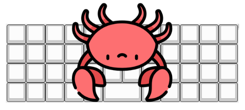
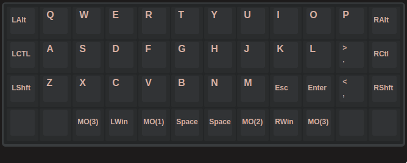
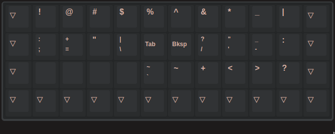
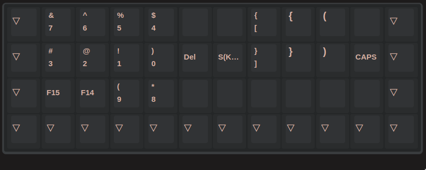
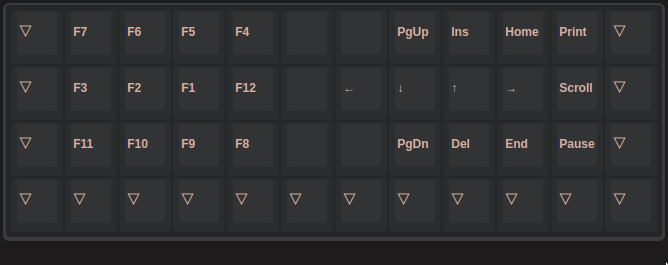

# crab layout

a symmetrical layout for planck mit keyboard, beautiful as hell

it's a happy crab... i rotate that [image](https://www.flaticon.com/free-icons/crab) 180 degrees...

# faq

- why symmetrical ctrl/alt/shift? i want my enter/esc/tab/backspace back!

	just trying to hit shift-t with left shift

	don't put those keys in their original positions, constantly reaching those keys with your pinky will cause repetitive strain injury, especially the enter key

- why not tap dance?

	suppose you have a mod-type key `MT(MOD_LCTL,KC_ESC)` in the position of caps lock, you have to release that key during the tapping term to get an esc, and you have to wait for the tapping term over to get a ctrl-l, which make neither mod nor type has good performance

- why those symbols & numbers?

	ergonomics based on 2 studies:

	- [xahlee's punctuations frequency](http://xahlee.info/comp/computer_language_char_distribution.html)

	

	- [workmanlayout's keys graded (approximately agree)](https://workmanlayout.org/#back-to-the-drawing-board)

	

	and if you are a vim user, you may understand why some symbols are placed in that position, generally, if you need shift key to input a symbol, the symbol is placed in the same location, if you can input a symbol directly, the symbol is placed in a better location

# layer0 ~ layer3

# note

`convert pic-selected-230307-1556-16.png -gravity South -pointsize 15 -fill gray -annotate 0 "https://github.com/aidancz/planck_crab" layer0.png`
