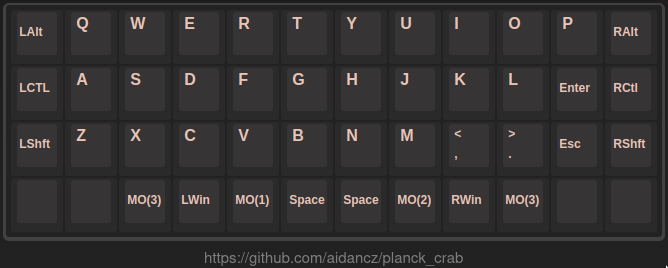
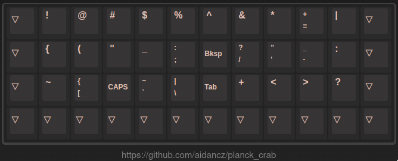
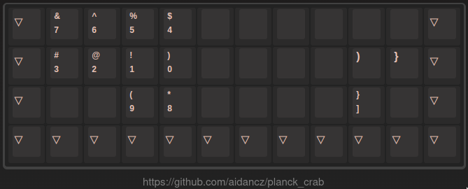
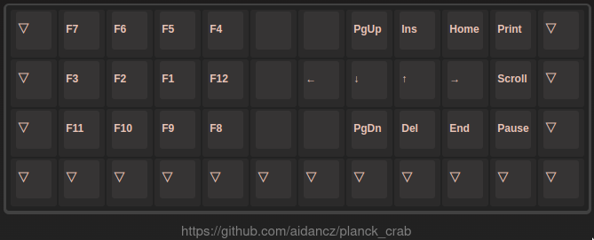

# crab layout


the default planck layout is hard to use! we are symmetrical, and we need 2 shift keys!

so here comes the crab layout

it's a happy crab... i rotate that [image](https://www.flaticon.com/free-icons/crab) 180 degrees...

# layer0 ~ layer3









# faq

- why not tap dance?

	suppose you have a mod-type key `MT(MOD_LCTL,KC_ESC)` in the position of caps lock, you have to release that key during the tapping term to get an esc, and you have to wait for the tapping term over to get a ctrl-l, which make neither mod nor type has good performance

- why paired ctrl/alt/shift/super?

	well, actually i made that decision before i switched from vim to emacs, but sooner i realized that it is extremely useful in emacs

	- vim

	```vim
	nnoremap <silent> J :m +1<cr>
	nnoremap <silent> K :m -2<cr>
	nnoremap <c-j> <c-d>
	nnoremap <c-k> <c-u>
	nnoremap <silent> <a-j> :put _<cr>
	nnoremap <silent> <a-k> :put! _<cr>
	```

	- emacs

	apparently it's easy to reach for ctrl/alt, but what for C-M-s? you can just type the gap between ctrl and alt (of course you need light switches), then hit s

- why those symbols & numbers?

	based on 2 pictures

	- [xahlee's punctuations frequency](http://xahlee.info/comp/computer_language_char_distribution.html)

	

	- [workman's keys graded (approximately agree)](https://workmanlayout.org/#back-to-the-drawing-board)

	

	and if you are a vim user, you may understand why some symbols are placed in that position, generally, if you need shift key to input a symbol, the symbol is placed in the same location, if you can input a symbol directly, the symbol is placed in a better location

- why qwerty?

	dvorak colemak carpalx colemak-dh workman norman halmak engram... none of them consider to include enter/esc in their layout

# note

`convert pic-selected-230307-1556-16.png -gravity South -pointsize 15 -fill gray -annotate 0 "https://github.com/aidancz/planck_crab" layer_0.png`
